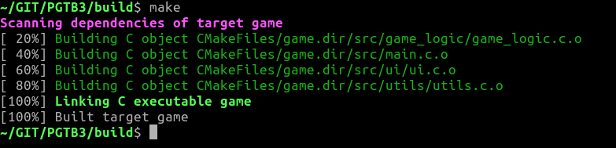

# PGTB3

Trabalho da cadeira de PG, onde temos que criar uma versão de solitario em C utilizando SDL2


## Estrutura de Diretórios

- **src/:** Contém o código-fonte do projeto.
  - *main.c:* Ponto de entrada do programa.
  - *game_logic/:* Funções relacionadas à lógica do jogo.
  - *ui/:* Código para a interface de usuário e renderização.
  - *utils/:* Funções utilitárias, como manipulação de strings, etc.
  - *include/:* Arquivos de cabeçalho (.h) que declaram funções e estruturas compartilhadas.

- **lib/:** Bibliotecas externas, como 'libpg'.

- **assets/:** Recursos gráficos e de mídia.
  - *images/:* Imagens das cartas e fundos.
  - *fonts/:* Tipos de letras, se necessário.

- **doc/:** Documentação do projeto.
  - *README.md:* Instruções gerais e descrição do projeto.
  - *Outros documentos:* Explicação do design e implementação (PDF da atividade...).

- **tests/:** Testes unitários e de integração (opcional).

- **bin/:** Arquivos executáveis compilados.

- **scripts/:** Scripts úteis, como scripts de build.

## Estrutura de Diretórios

```plaintext
.
├── assets
│   ├── font
│   └── images
│       └── cards
│           ├── b.png
│           ├── c2.png
│           ├── c3.png
│           ├── c4.png
│           ├── c5.png
│           ├── c6.png
│           ├── c7.png
│           ├── c8.png
│           ├── c9.png
│           ├── ca.png
│           ├── cj.png
│           ├── ck.png
│           ├── cq.png
│           ├── ct.png
│           ├── d2.png
│           ├── d3.png
│           ├── d4.png
│           ├── d5.png
│           ├── d6.png
│           ├── d7.png
│           ├── d8.png
│           ├── d9.png
│           ├── da.png
│           ├── dj.png
│           ├── dk.png
│           ├── dq.png
│           ├── dt.png
│           ├── h2.png
│           ├── h3.png
│           ├── h4.png
│           ├── h5.png
│           ├── h6.png
│           ├── h7.png
│           ├── h8.png
│           ├── h9.png
│           ├── ha.png
│           ├── hj.png
│           ├── hk.png
│           ├── hq.png
│           ├── ht.png
│           ├── s2.png
│           ├── s3.png
│           ├── s4.png
│           ├── s5.png
│           ├── s6.png
│           ├── s7.png
│           ├── s8.png
│           ├── s9.png
│           ├── sa.png
│           ├── sj.png
│           ├── sk.png
│           ├── sq.png
│           └── st.png
├── build
├── CMakeLists.txt
├── doc
├── lib
│   └── libpg
│       └── pg
│           ├── audio.h
│           ├── comm.h
│           ├── components.h
│           ├── events.h
│           ├── graphics.h
│           ├── http_cli.h
│           ├── http_srv.h
│           ├── json.h
│           ├── list.h
│           ├── pglib.h
│           ├── socket_events.h
│           ├── types.h
│           └── uv_srv.h
├── README.md
└── src
    ├── game_logic
    │   ├── game_logic.c
    │   └── game_logic.h
    ├── include
    │   └── common.h
    ├── main.c
    ├── ui
    │   ├── ui.c
    │   └── ui.h
    └── utils
        ├── utils.c
        └── utils.h
```
## Como Compilar o Projeto

Aqui estão os passos para compilar o projeto:

1. Abra um terminal no diretório raiz do projeto.

2. Execute o comando de compilação:

   ```bash
   cd build
   cmake ..
   make
   ```
3. Certifique-se de ter todas as dependências instaladas.

4. O executável será gerado no diretório game. Execute-o usando:

	```bash
   game
   ```


<p align="center">
	
</p>
<p align="center">
	
<p>


## Bibliografia

- [Creating a Game Loop with C & SDL (Tutorial)](www.youtube.com/watch?v=XfZ6WrV5Z7Y)
- [SDL Documentation](wiki.libsdl.org)
- [CMake Documentation](https://cmake.org/documentation/)
- [C Coding Standard](https://users.ece.cmu.edu/~eno/coding/CCodingStandard.html)
- [Doxygen Documentation](https://www.doxygen.nl/)
- [C Programming Notes (PDF)](https://microtek.ac.in/adminassets/pdf/C_programming_notes_.pdf)
- [Getting Started with CMake](https://cmake.org/getting-started/)
- [CMake Reference Documentation](https://cmake.org/cmake/help/latest/)
- [Get started with GitHub documentation](https://docs.github.com/en/get-started)

## Ferramentas

- [Pixel Verification Tool](https://pixspy.com/)

## Contribuição

Caso queira contribuir mande mensagem pelo git.
Contribuições apenas após entrega do projeto

